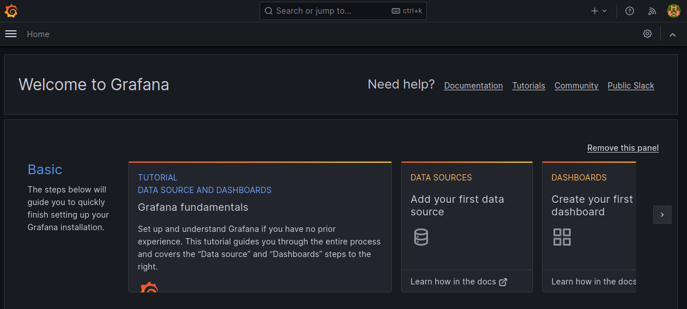
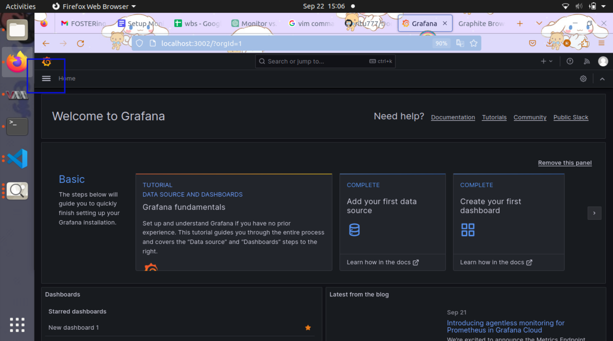
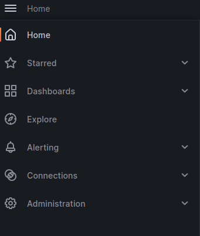
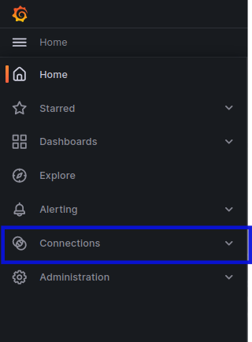
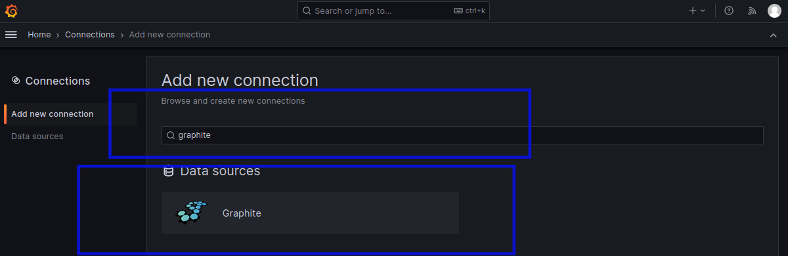
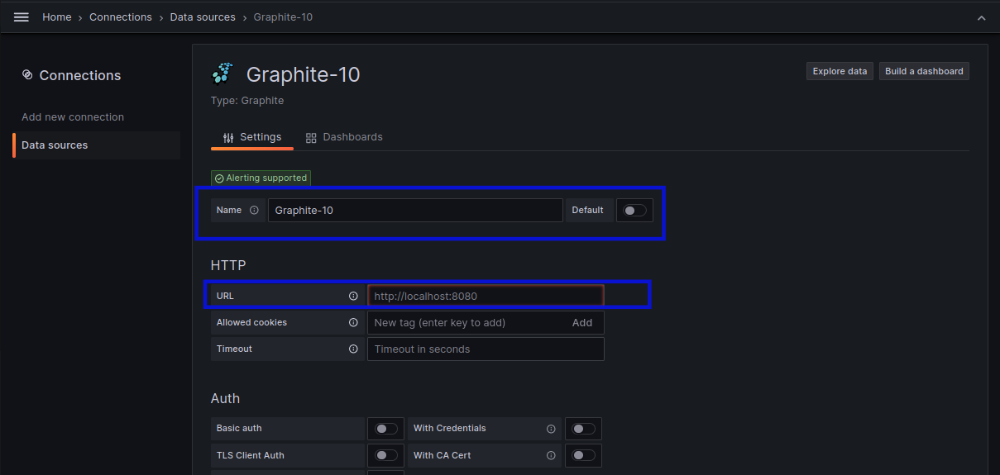
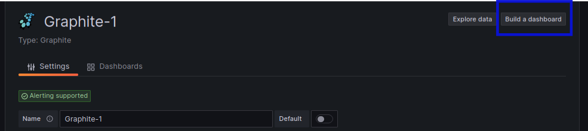
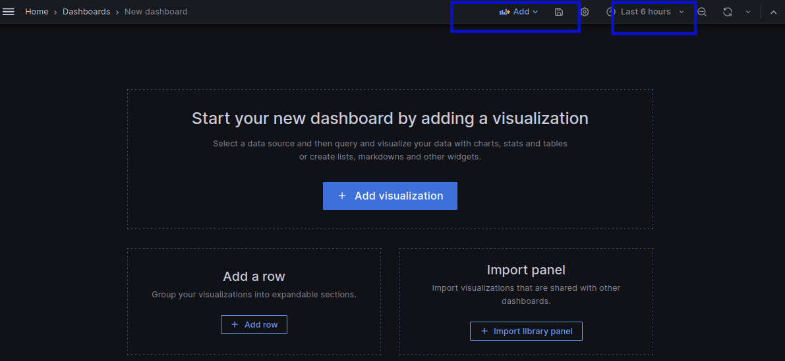
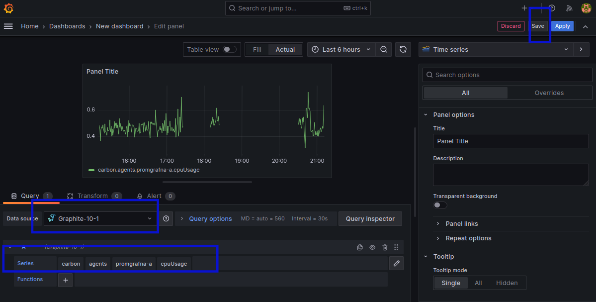
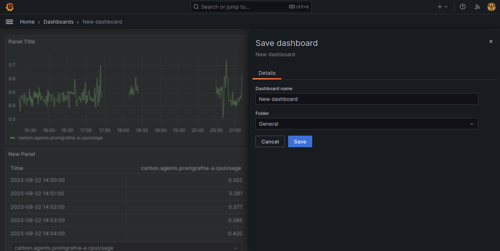

 <u><h1 style="text-align:center">SETUP OF GRAFANA WITH GRAPHITE </h1></u>

 ## Task Requirement :
To track the status and performance of their IT infrastructure. It provides a centralized platform for monitoring hosts, services, and network devices.

## Environment Details :
**Os**- Ubuntu 20.04</br>
**Cpu**- 8 Core</br>
**Storage**- 1 TB</br>

## Prerequisites Tools :
1. Podman 
2. Grafana 
3. Graphite
   
### Some steps  for installing grafana and graphite on container</br>
#### 1. First we need to install podman by using this command.
```
apt install -y podman
```
**apt:** apt stands for "Advanced Package Tool. It is used to install, update, and manage software packages on the system.

**install:** This is the sub-command that tells apt to install a package. When you use apt install, you're instructing the package manager to download and install the specified software.

**-y:** This is an option flag that stands for "yes." It's used to automatically answer "yes" to any prompts that may come up during the installation process.

**podman:** This is the name of the package or software you want to install.

##### 2. After that make script file with name of .sh
```
vim test.sh
```


 **Vim:** It is an editor to create or edit a text file.

 **test.sh:** It is the name of script file.

#### 3. Now write a script for what you want to install.

Here I have created a pod with the name of **promgrafna** and two containers with their port.


**#!/bin/bash:** This line is called a shebang and specifies the interpreter to be used for the script.

**podman pod create:** This command creates a pod using Podman, a container management tool similar to Docker.

 **--name promgrafna:** The pod is named "promgrafna".

**--publish:** It specifies several ports to be published, making services running in containers accessible on those ports. 

**3002:3000 -** This allows you to access the service running in the container on port 3000 through your host system on port 3002 for grafana.
 **8082:80** This port for graphite.

**2003-2004:2003-2004 -** This is typically used for the Carbon-cache service in Graphite, which handles incoming metric data.

**2023-2024:2023-2024  -** These ports are often used for the Carbon-relay service in Graphite.

**8125:8125/udp -** UDP is a transport protocol commonly used for metrics and data that can tolerate some loss in transit. Graphite StatsD, which is often used for collecting metrics, typically listens on this port.

**8126:8126 -** This port is sometimes used for administrative or management purposes in Graphite.

**podman run -d --pod promgrafna --name grafana grafana/grafana**

This command runs a container named "grafana" using the "grafana/grafana" image within the "promgrafna" pod.

**podman run -d --name graphite --pod promgrafna graphiteapp/graphite-statsd**

This command runs another container named "graphite" using the "graphiteapp/graphite-statsd" image within the same "promgrafna" pod.

#### 4. Now pod and container has installed.


##### 5. Now check container status.
```
podman ps -a
```


##### 6. Go to the web interface.

type **localhost:3002** for grafana's dashboard and  **localhost:8082** for graphite dashboard.

Then you will get grafana's dashboard and there you can put username and password.

**admin** is the default username and password and after that login grafana dashboard will come.


After login grafana dashboard will come.




And, this is the dashboard of graphite.


####  Integerate  part of grafana with graphite :

**Step-1 :** Go to the left side of navigation bar.



**Step-2:** Click on navigation bar then you will get options.



**Step-3:** Click on connection option.


Here you will get interface like this:


**Step-4:** Now you have to search your data source in search bar like here I am using graphite.



**Step-5:** After selecting data source then you will get interface and click on  add new data source.


**Step-6:** Now you can write name which is suitable for you and in url section-
  "http://your_server_ip address:8080".




**Step-7:** After filling url part you have to scroll down and click on save & test option.


 Then you have to scroll up and go to the left side where you get option to build dashboard.

 

**Step-8:** After clicking on build dashboard option,it will come and you have to change time and go to the add option.



Choose data source and mertices which you want to monitor.


Here you have to select metrices like how I selected in given image and click on save option.


**Step-9** Here you can give suitable name for dashboard and save.


Now panel will come of graph and table form here you can visual you performance.


